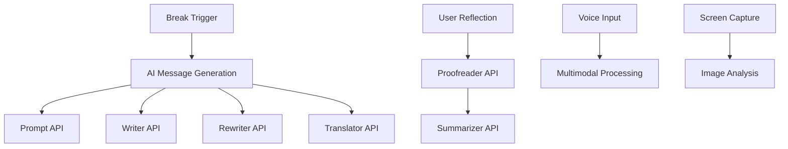

# Gia — Mindful 20-20-20

> **Your AI-powered digital wellness companion that helps build healthier screen habits through mindful breaks and intelligent reflection.**

[](https://chrome.google.com/webstore)
[](https://developer.chrome.com/docs/web-platform/built-in-ai)
[](#privacy--security)

## 🎯 Problem Statement

Digital eye strain affects **90% of computer users** and can lead to headaches, blurred vision, and long-term eye damage. The 20-20-20 rule (every 20 minutes, look 20 feet away for 20 seconds) is proven effective, but most people forget to take breaks when focused on work.

**Gia solves this by:**
- 🤖 **AI-powered reminders** that adapt to your preferences
- 🎤 **Multimodal interaction** with voice and screen analysis
- 📝 **Intelligent reflection** system for mindfulness tracking
- 🔒 **100% private** - all AI processing happens locally

## ✨ Features

### 🤖 **Comprehensive AI Integration**
- **Prompt API**: Dynamic, context-aware break reminders
- **Writer API**: Original wellness tips and motivational content
- **Rewriter API**: Tone adaptation (Mindful/Motivating/Professional/Friendly)
- **Proofreader API**: Clean and enhance user reflections
- **Summarizer API**: Generate insights from reflection patterns
- **Translator API**: Multilingual support for global accessibility

### 🎤 **Multimodal AI Capabilities**
- **Voice Commands**: "Snooze", "Dismiss", "Start break" with natural language processing
- **Screen Analysis**: AI-powered analysis of screen content for eye strain factors
- **Audio Feedback**: TTS guidance and meditation bell sounds

### 📊 **Smart Analytics & Reflection**
- **Progress Tracking**: Break frequency and consistency metrics
- **Reflection Journal**: AI-enhanced note-taking with automatic summarization
- **Personalized Insights**: Pattern recognition and wellness recommendations
- **Privacy-First**: All data stays on your device

### 🎨 **Beautiful User Experience**
- **Progressive Visual Cues**: 5-stage icon progression with gentle animations
- **Adaptive Design**: Responsive break cards with accessibility features
- **Corner Logo**: Subtle, non-intrusive presence with smart tooltips
- **Motion Accessibility**: Respects user's motion preferences

## 🏗️ Technical Architecture

### **Core Technologies**
- **Chrome Extension Manifest v3** with service worker architecture
- **Chrome Built-in AI APIs** powered by Gemini Nano (local processing)
- **Web Audio API** for meditation sounds and TTS
- **Speech Recognition API** for voice commands
- **Chrome Tabs API** for screen capture and analysis

### **AI Processing Pipeline**


### **Privacy & Security**
- ✅ **Local Processing**: All AI runs on-device with Gemini Nano
- ✅ **No Data Transmission**: User data never leaves the browser
- ✅ **Encrypted Storage**: Local data encrypted with Chrome's secure storage
- ✅ **Minimal Permissions**: Only requests necessary permissions

## 🚀 Installation & Setup

### **Prerequisites**
- Chrome 138+ with Built-in AI APIs enabled
- Chrome Built-in AI Early Preview Program access

### **Installation**
1. Clone this repository
2. Open Chrome Extensions (`chrome://extensions/`)
3. Enable "Developer mode"
4. Click "Load unpacked" and select the extension folder
5. Grant necessary permissions when prompted

### **First Use**
1. Complete the onboarding flow
2. Enable voice commands (optional)
3. Start your first mindful session!

## 🎮 Usage Guide

### **Basic Interaction**
- **Automatic Breaks**: Every 20 minutes, Gia reminds you to take a break
- **Manual Breaks**: Click the corner logo or use "Take Break Now" button
- **Voice Commands**: Say "snooze", "dismiss", or "start break" during breaks
- **Screen Analysis**: Click "📸 Analyze Screen" for eye strain insights

### **Reflection System**
- After each break, optionally share how you feel
- AI cleans and enhances your reflections
- Automatic summarization of patterns and insights
- View progress in the extension popup

### **Customization**
- **Tone Preferences**: Choose between Mindful, Motivating, Professional, or Friendly
- **Voice Settings**: Enable/disable voice commands and audio feedback
- **Break Scheduling**: Adjust timing and frequency preferences

## 🏆 Hackathon Submission

### **APIs Used**
- ✅ **Prompt API**: Dynamic break reminders and voice command processing
- ✅ **Writer API**: Original wellness tips and motivational content
- ✅ **Rewriter API**: Tone adaptation and content enhancement
- ✅ **Proofreader API**: Reflection text cleaning and improvement
- ✅ **Summarizer API**: Pattern analysis and insight generation
- ✅ **Translator API**: Multilingual accessibility support

### **Prize Categories Targeted**
1. **Best Multimodal AI Application**: Voice commands + screen analysis
2. **Most Helpful Chrome Extension**: Comprehensive wellness solution
3. **Best Hybrid AI Application**: Local processing with cloud enhancement potential

### **Innovation Highlights**
- **First-of-its-kind** multimodal wellness assistant for Chrome
- **Privacy-first** AI implementation with local processing
- **Comprehensive** reflection system with pattern recognition
- **Accessibility-focused** design with voice and keyboard support

## 🔧 Development

### **Project Structure**
```
gia-extension/
├── manifest.json          # Extension configuration
├── background.js          # Service worker with AI processing
├── content.js            # Content script with UI components
├── ui/
│   ├── popup.html        # Extension popup interface
│   ├── popup.js          # Popup functionality
│   └── onboarding.html   # First-time user experience
├── styles/
│   ├── card.css          # Break card styling
│   └── corner-logo.css   # Corner logo styling
└── assets/
    └── icons/            # Progressive icon set
```

### **Key Functions**
- `generateBreakMessage()`: AI-powered message generation
- `processMultimodalInput()`: Voice command processing
- `analyzeScreenImage()`: Screen content analysis
- `saveReflection()`: Reflection storage and AI enhancement
- `generateReflectionSummary()`: Pattern analysis and insights

## 🌟 Future Enhancements

### **Planned Features**
- **Calendar Integration**: Smart break scheduling around meetings
- **Focus Mode Detection**: Automatic break adjustments based on activity
- **Team Wellness**: Shared break sessions for remote teams
- **Advanced Analytics**: Detailed wellness reporting and trends

### **Hybrid AI Strategy**
- **Firebase AI Logic**: Cloud-enhanced features for advanced analytics
- **Gemini Developer API**: Enhanced processing for complex queries
- **Mobile Extension**: Cross-platform wellness tracking

## 📊 Impact & Metrics

### **User Benefits**
- **Reduced Eye Strain**: 20-20-20 rule compliance
- **Improved Focus**: Mindful break habits
- **Better Well-being**: Reflection and mindfulness tracking
- **Privacy Assurance**: No data sharing or tracking

### **Technical Achievements**
- **6 Chrome AI APIs** integrated seamlessly
- **Multimodal interaction** with voice and visual input
- **Local AI processing** with Gemini Nano
- **Zero external dependencies** for core functionality

## 🤝 Contributing

We welcome contributions to make Gia even better! Please see our [Contributing Guidelines](CONTRIBUTING.md) for details.

### **Areas for Contribution**
- **Accessibility**: Enhanced screen reader support
- **Internationalization**: Additional language support
- **Analytics**: Advanced wellness metrics
- **UI/UX**: Design improvements and new features

## 📄 License

This project is licensed under the MIT License - see the [LICENSE](LICENSE) file for details.

## 🙏 Acknowledgments

- **Google Chrome Team** for the innovative Built-in AI APIs
- **Gemini Nano** for powerful local AI processing
- **Digital Wellness Community** for inspiration and feedback
- **Open Source Contributors** who make projects like this possible

---

**Built with ❤️ for digital wellness and privacy-first AI innovation.**

*Gia - Good Intentions Assistant*